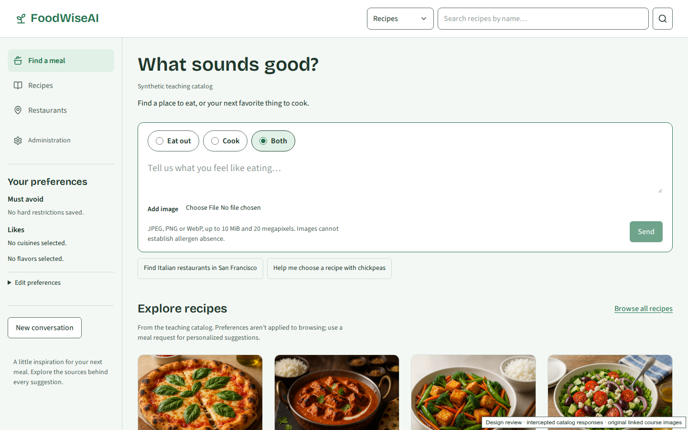
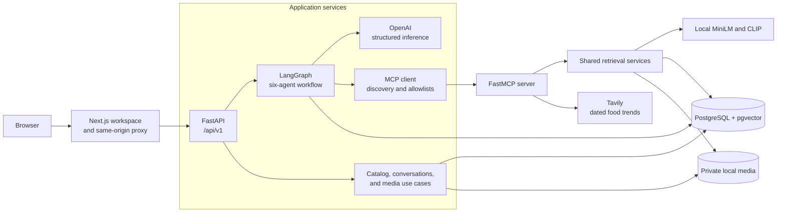
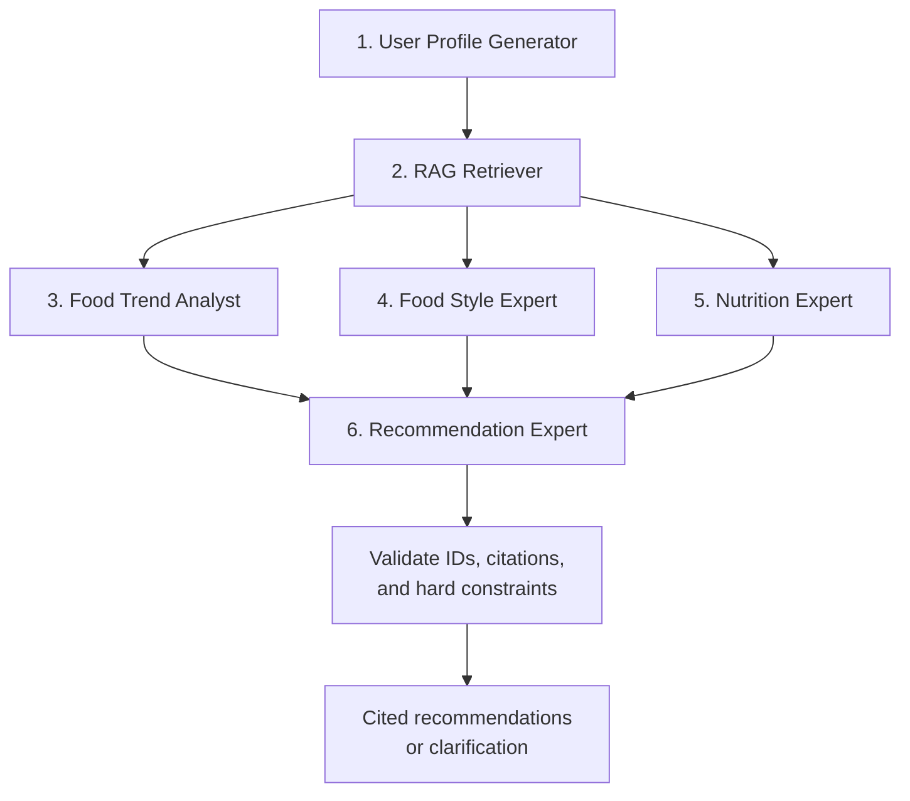

# FoodWiseAI

FoodWiseAI is a conversational restaurant and recipe recommender built around a
simple question: **what sounds good?** Describe a meal, share a food image, or refine
your preferences to discover places to eat and dishes to cook, with explanations
and citations you can inspect.

Developed as an IBM food recommendation capstone, the application combines six
LangGraph agents, multimodal retrieval, PostgreSQL/pgvector, OpenAI, and live food
trend search in a local FastAPI and Next.js workspace.



_Desktop workspace captured with catalog fixtures and their linked course images._

[](https://github.com/rensilver/foodwise-ai/actions/workflows/ci.yml)

[Features](#features) · [Architecture](#architecture) · [Repository structure](#repository-structure) · [Run locally](#run-locally) · [Development](#development) · [Documentation](#documentation)

## Features

- **Conversational discovery:** choose Eat out, Cook, or Both; ask follow-up
  questions and retain preferences across a conversation.
- **Text and image search:** retrieve restaurants, recipes, and scoped review
  evidence using lexical search, semantic embeddings, and linked food imagery.
- **Personalized recommendations:** combine cuisine, location, budget, flavor
  preferences, and explicit dietary restrictions, ranking restaurants and recipes
  separately.
- **Inspectable evidence:** open source excerpts, entity references, and dated
  trend citations behind each recommendation.
- **Responsive meal workspace:** browse the catalog, explore details, upload
  images, follow streamed activity, and cancel a request.
- **Local catalog administration:** sign in, preview extraction from a description,
  then explicitly create, edit, or delete records with transactional index updates.

## Architecture

The browser talks to a same-origin Next.js proxy. FastAPI owns recommendation
behavior, conversation ownership, validation, and catalog writes. A separate
FastMCP process exposes shared retrieval services and bounded Tavily searches to
the agent workflow.



### Six-agent workflow

Profile extraction and retrieval run sequentially. The trend, style, and
nutrition experts then run asynchronously; an explicit join collects all three
outcomes before the recommendation expert synthesizes the response.



| Agent                  | Responsibility                                                                                                       |
| ---------------------- | -------------------------------------------------------------------------------------------------------------------- |
| User Profile Generator | Extract intent and preferences, preserve restrictions, and clarify contradictions.                                   |
| RAG Retriever          | Build a typed retrieval plan, call allowlisted MCP tools, and refine insufficient queries within a fixed budget.     |
| Food Trend Analyst     | Associate candidates with fresh, dated web evidence and its actual sources.                                          |
| Food Style Expert      | Assess cuisine, flavor, and style using canonical candidate facts and retrieved excerpts.                            |
| Nutrition Expert       | Combine deterministic ingredient checks with structured analysis; retain conflicting or unknown dietary assessments. |
| Recommendation Expert  | Synthesize expert outcomes and return only validated catalog entities and citations.                                 |

PostgreSQL-backed LangGraph checkpoints retain conversational context. Each turn
has its own run ID, bounded retries and time budget, and cancellation handling.
The API persists a completed response before streaming its final payload.

### Retrieval design

1. Turn intent, explicit constraints, and optional image IDs into a validated
   query plan.
2. Apply category-specific filters and hard dietary constraints to eligible
   restaurant, recipe, review, and image evidence.
3. Combine PostgreSQL full-text search and MiniLM cosine search with reciprocal
   rank fusion (`k=60`, equal branch weights).
4. Search CLIP image vectors using compatible text or image embeddings; preserve
   each image's actual recipe or review association.
5. Normalize scores within each category and apply late fusion with initial
   text/image weights of `0.6/0.4`. Deduplicate by canonical entity and renormalize
   available modalities when necessary.
6. Analyze up to 20 candidates per requested category and return at most five
   unique recommendations per category with supported citations.

| Layer             | Technology                                                                              |
| ----------------- | --------------------------------------------------------------------------------------- |
| Frontend          | Next.js App Router, React, strict TypeScript, Tailwind CSS, Radix/shadcn-style controls |
| API and contracts | FastAPI, Pydantic, POST server-sent events, generated OpenAPI TypeScript types          |
| Orchestration     | LangGraph with PostgreSQL checkpoints                                                   |
| Inference         | OpenAI; text and vision models independently default to `gpt-4o-mini`                   |
| Persistence       | PostgreSQL 16, pgvector, SQLAlchemy, Alembic, async psycopg                             |
| Text embeddings   | `sentence-transformers/all-MiniLM-L6-v2`, normalized 384-dimensional vectors            |
| Image embeddings  | `openai/clip-vit-base-patch32`, 512-dimensional vectors                                 |
| Tools and trends  | FastMCP over Streamable HTTP or stdio; Tavily with a freshness-aware cache              |
| Verification      | Ruff, mypy, pytest, ESLint, Vitest, Playwright, and axe accessibility checks            |

## Repository structure

```text
foodwise-ai/
├── backend/
│   ├── src/food_recommender/
│   │   ├── domain/             # Culinary entities, values, and invariants
│   │   ├── application/        # Use cases, narrow ports, and transaction contracts
│   │   ├── agents/             # Six roles, graph state, prompts, and orchestration
│   │   ├── retrieval/          # Query plans, evidence, chunking, and fusion
│   │   ├── ingestion/          # Source adaptation, validation, and import workflow
│   │   ├── infrastructure/
│   │   │   ├── persistence/   # ORM models, repositories, search, and indexing
│   │   │   ├── embeddings/    # Local MiniLM and CLIP adapters
│   │   │   ├── providers/     # OpenAI and Tavily adapters
│   │   │   ├── media/         # Storage, decoding, and approved-host downloads
│   │   │   └── telemetry/     # Optional operational tracing adapters
│   │   ├── api/               # FastAPI routers, schemas, dependencies, and SSE
│   │   ├── mcp/               # FastMCP server/client, tools, and resources
│   │   ├── transport/         # Shared ASGI behavior
│   │   ├── cli/               # Ingestion and text/image retrieval commands
│   │   └── composition.py     # Adapter wiring and dependency injection
│   ├── migrations/            # Alembic application migrations
│   ├── scripts/               # Provisioning, diagnostics, and evaluation tools
│   └── tests/                 # Unit, contract, and real database integration tests
├── frontend/
│   ├── src/
│   │   ├── app/               # Route shells, metadata, and same-origin proxy
│   │   ├── features/          # Chat, preferences, recommendations, and catalog
│   │   ├── components/        # Shared accessible UI
│   │   └── lib/               # Product name, generated contracts, and clients
│   ├── public/                # Static assets and local fonts
│   └── tests/                 # Component, browser, and real API journeys
├── data/                      # Seed datasets and separately restored course media
├── evaluation/                # Labeled queries, reports, and screenshots
├── infra/                     # Containers, CI guidance, setup, and recovery tools
├── scripts/                   # Source audit and redacting secret scanner
├── .github/workflows/         # Automated quality checks
├── compose.yaml               # Local database, MCP, API, and frontend services
└── .env.example               # Configuration template without credentials
```

Dependencies point inward: domain rules remain independent of frameworks and
adapters, application services consume narrow ports, and `composition.py` wires
concrete implementations. The frontend uses generated API contracts and leaves
culinary rules and persistence behind FastAPI. See the
[backend package guide](backend/PACKAGES.md) for the complete dependency rules.

## Run locally

Run the following commands from the repository root unless stated otherwise.
The setup uses Docker Engine/Compose, GNU Make, and these pinned host tools:

| Tool    | Version   | Pin                                                |
| ------- | --------- | -------------------------------------------------- |
| Python  | `3.12.14` | [backend/.python-version](backend/.python-version) |
| uv      | `0.12.5`  | [backend/pyproject.toml](backend/pyproject.toml)   |
| Node.js | `24.19.0` | [.nvmrc](.nvmrc)                                   |
| pnpm    | `12.8.1`  | [frontend/package.json](frontend/package.json)     |

The documented setup is verified on Linux x86_64. Use the
[detailed installation guide](infra/release-setup.md) for isolated installations
and media recovery options.

### 1. Clone and install dependencies

```bash
git clone https://github.com/rensilver/foodwise-ai.git
cd foodwise-ai

cd backend
uv python install 3.12.14
uv sync --locked
uv pip check
cd ../frontend
pnpm install --frozen-lockfile
cd ..
```

### 2. Configure local credentials

```bash
test -e .env || cp .env.example .env
chmod 600 .env
```

Edit `.env` using the [configuration template](.env.example):

| Setting                               | Value to supply                                                                      |
| ------------------------------------- | ------------------------------------------------------------------------------------ |
| `OPENAI_API_KEY`                      | Your OpenAI API key with access to the configured models.                            |
| `OPENAI_MODEL`, `OPENAI_VISION_MODEL` | Text and vision model IDs; both default to `gpt-4o-mini`.                            |
| `TAVILY_API_KEY`                      | Your Tavily key for live food trends. Leaving it blank disables live trend evidence. |
| `POSTGRES_PASSWORD`                   | A generated password for database initialization and maintenance.                    |
| `FOODWISE_DB_PASSWORD`                | A different URL-safe password for the limited application database role.             |
| `ADMIN_PASSWORD_HASH`                 | A single-quoted Argon2id hash for your local administrator password.                 |
| `MINILM_ROOT`, `CLIP_ROOT`            | Absolute paths to the model directories provisioned below.                           |

Generate each database password independently with `openssl rand -hex 32`.
Generate the administrator hash interactively from `backend/`:

```bash
uv run --locked python -c 'from getpass import getpass; from argon2 import PasswordHasher; print(PasswordHasher(memory_cost=65536, time_cost=3, parallelism=1).hash(getpass("New local administrator password: ")))'
```

Compose supplies internal database/MCP URLs and the mounted media path.
`DATABASE_URL`, `MCP_SERVER_URL`, and `MEDIA_ROOT` in `.env` are used when running
host processes. Keep credentials in the root `.env`; frontend configuration uses
only the server-side API origin. Provider calls use your OpenAI/Tavily accounts;
ordinary health checks and offline tests make no paid inference/search calls.

### 3. Provision models and restore recipe images

```bash
export MINILM_ROOT="$PWD/.local-tmp/minilm"
export CLIP_ROOT="$PWD/.local-tmp/clip"
cd backend
make provision-minilm
make provision-clip
cd ..
```

Set `MINILM_ROOT` and `CLIP_ROOT` in `.env` to these same absolute paths. The
provisioning scripts download pinned public model revisions and record file
hashes; serving processes mount the bundles read-only.

Recipe imagery is distributed separately from Git. Place the recovered course
archive at `data/synthetic-recipe-images.zip`. It contains the 109 recipe images
associated by `recipe{id}.png`; ingestion validates archive integrity, safe
paths, image decoding, and entity associations. The original course PDFs and
notebooks are educational artifacts and are separate from runtime retrieval.

### 4. Build, initialize, and start the application

```bash
docker compose config --quiet
docker compose build backend
docker compose build frontend
docker compose up -d db --wait --wait-timeout 180
```

The production backend image keeps setup files outside the runtime package.
Define this helper in the same shell to mount migrations, seeds, and provenance
ledgers read-only while writing imported media to the named media volume:

```bash
setup() {
  docker compose run --rm --no-deps -T --workdir /setup \
    --volume "$PWD/backend:/setup:ro" \
    --volume "$PWD/data:/seed:ro" \
    --volume "$PWD/evaluation:/evidence:ro" \
    --volume "$CLIP_ROOT:/var/lib/foodwise/models/clip:ro" \
    --env CLIP_ROOT=/var/lib/foodwise/models/clip \
    backend "$@"
}

setup alembic upgrade head
setup python scripts/setup_checkpoints.py
setup python -m food_recommender.cli.ingestion import \
  --data-root /seed \
  --mapping /evidence/phase0/restaurant_reconciliation.json \
  --accepted /evidence/phase3/accepted_restaurant_additions.json \
  --corrections /evidence/phase3/restaurant_corrections.json \
  --recipe-zip /seed/synthetic-recipe-images.zip \
  --report /var/lib/foodwise/media/.setup/manifest.json \
  --download-review-images
setup python -m food_recommender.cli.text \
  --model-root /var/lib/foodwise/models/minilm index
setup python -m food_recommender.cli.image \
  --clip-root /var/lib/foodwise/models/clip index

docker compose up -d --no-build --wait --wait-timeout 180
docker compose ps
curl --fail http://127.0.0.1:8000/api/v1/health/ready
curl --fail http://127.0.0.1:3000/health/live
```

Open **[FoodWiseAI at http://127.0.0.1:3000](http://127.0.0.1:3000)**.
The API is available at `http://127.0.0.1:8000/api/v1`; database and MCP services
stay on the private Compose network. Ingestion and indexing are resumable and
skip unchanged inputs.

Use `docker compose logs -f backend mcp frontend` for application logs and
`docker compose down` to stop the stack while preserving database/media volumes.
See the [backup and restore guide](infra/backup-restore.md) for paired recovery.

## Development

For host development, configure reachable PostgreSQL and MCP addresses, the
provisioned model paths, and a writable media directory. Initialize migrations,
checkpoints, and the catalog before serving requests. The
[developer workflow](infra/development.md#host-development) explains dependency
setup and host configuration.

Run each service in a separate terminal, using the indicated directory:

```bash
# backend/: MCP
uv run --locked uvicorn food_recommender.mcp.server:create_app --factory \
  --env-file ../.env --host 127.0.0.1 --port 8001 --reload --no-access-log
```

```bash
# backend/: FastAPI
uv run --locked uvicorn food_recommender.api.main:create_app --factory \
  --env-file ../.env --host 127.0.0.1 --port 8000 --reload --no-access-log
```

```bash
# frontend/: Next.js, in a shell without backend credentials
pnpm dev
```

### API and MCP interfaces

The HTTP API uses the `/api/v1` prefix. Its committed
[OpenAPI schema](frontend/src/lib/api/openapi.json) generates the
[frontend TypeScript contracts](frontend/src/lib/api/generated.ts).

| Interface                                                                              | Purpose                                                                         |
| -------------------------------------------------------------------------------------- | ------------------------------------------------------------------------------- |
| `POST /conversations`                                                                  | Create a conversation owned by the local browser session.                       |
| `GET`, `DELETE /conversations/{id}`                                                    | Read history or delete conversation-owned data.                                 |
| `POST /conversations/{id}/messages`                                                    | Submit text, preferences, and media IDs; stream progress and validated results. |
| `GET /restaurants`, `GET /recipes`, and item routes                                    | Browse filtered pages and source-backed entity details.                         |
| `POST /media`, `GET /media/{id}`                                                       | Upload validated images and read authorized media.                              |
| `/admin/session`, `/admin/extractions/preview`, `/admin/restaurants`, `/admin/recipes` | Local authentication, extraction previews, and version-checked CRUD.            |
| `GET /health/live`, `GET /health/ready`                                                | Check process health and dependency readiness.                                  |

SSE events are `progress`, `clarification`, `recommendations`, `error`, and
terminal `done`. The browser uses POST `fetch` streaming and recovers conversation
history after a disconnect without automatically replaying inference.

MCP exposes `get_restaurant_info`, `recommend_by_vibe`, `get_review`,
`search_restaurants`, `search_recipes`, `search_images`, and `search_food_trends`,
plus culinary-map, manifest, and provenance resources. Tools are discovered at
runtime, validated, and restricted by agent role. Both Streamable HTTP and stdio
transports share the same application services.

### Quality checks

| Directory       | Command                          | Coverage                                                                                             |
| --------------- | -------------------------------- | ---------------------------------------------------------------------------------------------------- |
| `backend/`      | `make check`                     | Ruff, formatting, mypy, OpenAPI drift, and pytest.                                                   |
| `backend/`      | `make test-integration`          | Real PostgreSQL/pgvector behavior; requires a disposable `TEST_DATABASE_URL`.                        |
| `frontend/`     | `pnpm check`                     | Generated contracts, formatting, ESLint, TypeScript, unit/component tests, and configuration checks. |
| `frontend/`     | `pnpm test:e2e:install`          | Install the pinned Chromium browser.                                                                 |
| `frontend/`     | `pnpm test:e2e`                  | Production browser journeys, responsive layouts, keyboard behavior, and axe checks.                  |
| `frontend/`     | `pnpm test:e2e:integration`      | Real API/database/MCP journeys with controlled inference.                                            |
| Repository root | `python scripts/scan_secrets.py` | Redacting source-pattern scan.                                                                       |

Normal CI uses fake provider boundaries and provisioned local model fixtures.
Real integration suites use isolated test databases; run database suites and
frontend builds/browser suites sequentially. See the
[CI reproduction guide](infra/ci.md) and
[browser integration setup](evaluation/phase9/README.md#reproduction).

After changing API schemas, run `make api-schema` in `backend/`, then
`pnpm api:generate` in `frontend/`. Generated files are checked for drift.

## Data and evidence

The seed catalog contains **210 restaurant records, 109 recipes, and 10 synthetic
reviews**. Base and augmented records share canonical identities; imported
captions enrich the existing entities. Source files, record IDs, hashes, model
revisions, and media associations preserve provenance through ingestion and
retrieval.

- Personalization is content-based. The interface labels the synthetic teaching
  catalog, and dataset ratings and price bands remain attributed source facts.
- Hard dietary restrictions are enforced outside the LLM. Conflicting or unknown
  compliance is withheld; images and captions cannot establish allergen absence.
  Nutrition analysis does not provide measured nutrient quantities or
  cross-contact guarantees.
- Trend claims require dated, fresh evidence. Missing or stale evidence produces
  an explicit unavailable outcome, and trend searches cannot invent catalog facts.
- Recommendations and citations are validated against retrieved entities.
  Insufficient evidence can produce fewer results or a clarification.
- Uploaded JPEG, PNG, and WebP images are decoded, stripped of metadata, bounded
  to 10 MiB and 20 megapixels, and accessed through owned media IDs.

## Documentation

| Guide                                                                | Contents                                                                           |
| -------------------------------------------------------------------- | ---------------------------------------------------------------------------------- |
| [Backend](backend/README.md)                                         | Configuration, persistence, ingestion, retrieval, agents, and HTTP contracts.      |
| [Package organization](backend/PACKAGES.md)                          | Layer responsibilities, dependency rules, and adapter wiring.                      |
| [Release paths](infra/release-paths.md)                              | Clean-checkout module/CLI checks, setup-script paths, and ORM registration.          |
| [Frontend](frontend/README.md)                                       | Feature boundaries, generated types, streaming, and browser checks.                |
| [Installation](infra/release-setup.md)                               | Clean-checkout setup, models, media, initialization, and persistence verification. |
| [Developer workflow](infra/development.md)                           | Locked dependencies, host servers, migrations, and quality commands.               |
| [CI](infra/ci.md)                                                    | Automated checks and isolated database/model reproduction.                         |
| [Backup and restore](infra/backup-restore.md)                        | Paired PostgreSQL/media backups and recovery verification.                         |
| [Live demonstration](infra/live-demo.md)                             | Text/image recommendations, six-agent execution, trends, and follow-ups.           |
| [Administrator demonstration](infra/admin-demo.md)                   | Preview, create, edit, conflict handling, and confirmed deletion.                  |
| [Evaluation](evaluation/README.md)                                   | Labeled fixtures, retrieval metrics, acceptance scenarios, and evidence reports.   |
| [UI gallery](evaluation/redesign/README.md#screenshots-and-critique) | Desktop/mobile captures and interaction verification.                              |

FoodWiseAI adapts the IBM capstone's extraction, multimodal RAG, specialized
agents, and MCP lessons into a FastAPI/Next.js application. Original datasets and
course attribution are preserved; course documents guide the architecture while
culinary records supply the recommendation evidence.
