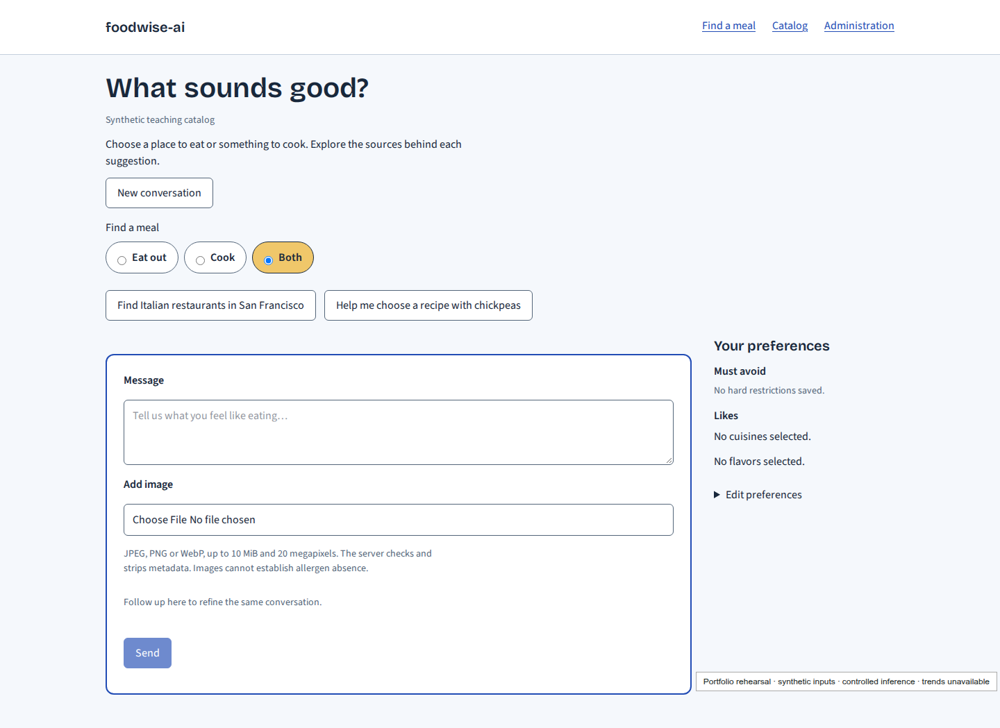
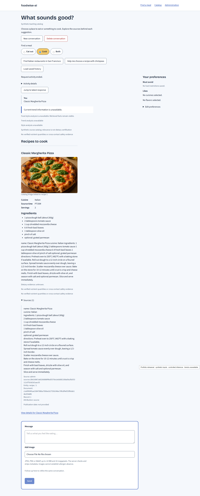
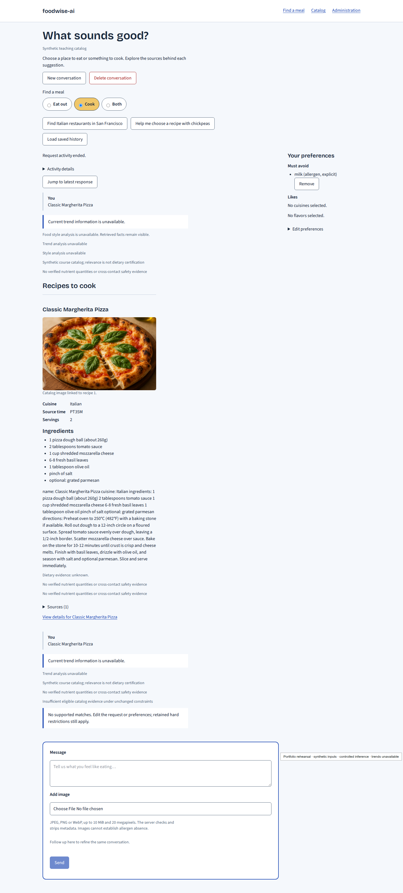
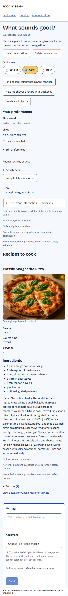
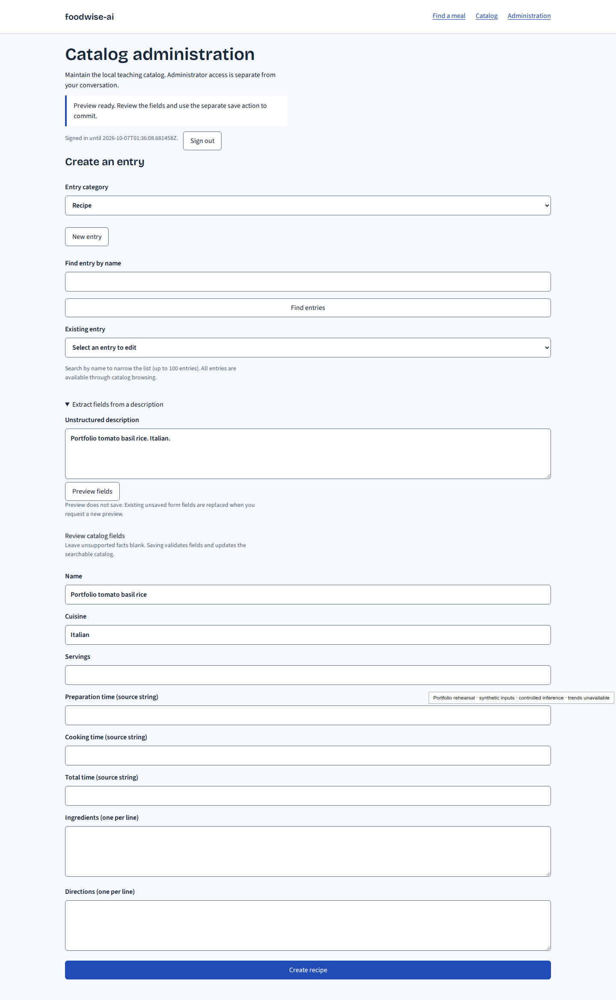
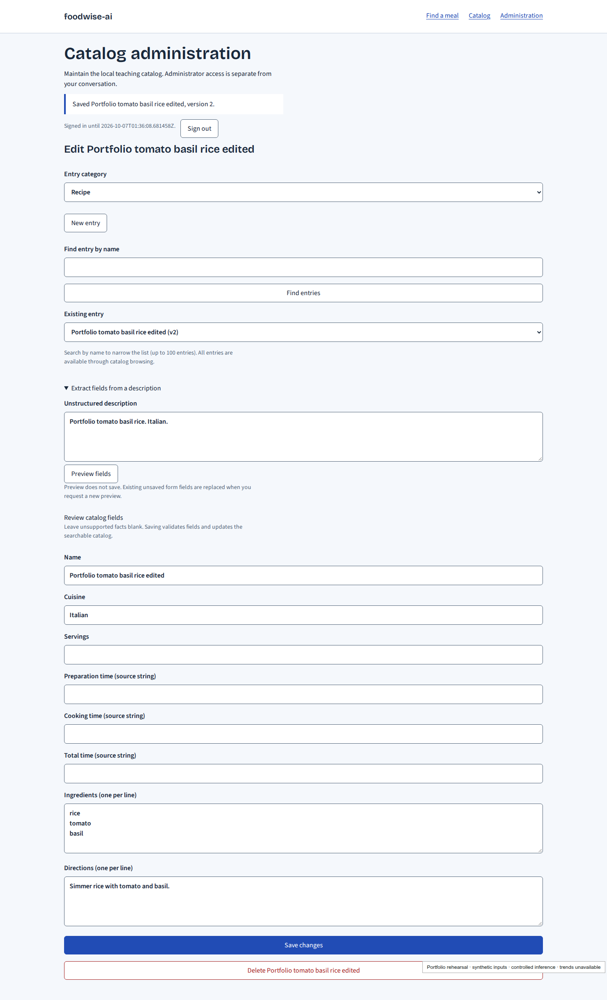
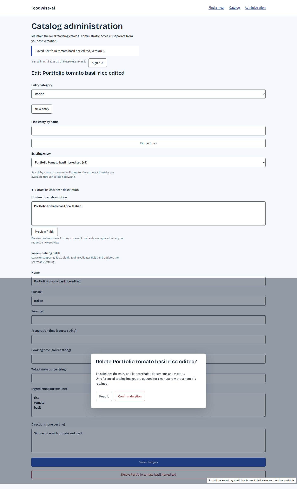

# foodwise-ai portfolio gallery

Captured on 2026-10-06 (America/Recife). These seven sanitized Chromium captures
show the production Next.js/FastAPI UI using a disposable PostgreSQL/pgvector
catalog, real HTTP MCP and pretrained CPU MiniLM/CLIP retrieval. Prompts and
administrator entries are synthetic. Inference/extraction are controlled;
trend and style analysis are unavailable and labeled in the UI. No paid provider
or Cloud calls occur. The capture harness adds the rehearsal label to each
image; it is not an application feature.

The [capture report](portfolio_report.json) records exact versions, model/script
identities, image dimensions/byte sizes/SHA-256 hashes, executed browser/database
checks and cleanup. The [presenter guide](../../infra/portfolio-demo.md) gives
the seven scenes and reproduction command. Use the separate
[live P11-04 evidence](README.md#p11-04--live-text-image-six-agent-and-follow-up-demonstration)
for all six successful real-provider roles and dated trend claims.

These images demonstrate the replacement stack for a portfolio. The
[original course requirements](course-screenshots.md) remain separate, with
no original-lab submission or grading equivalence claimed. Committing this
gallery does not publish it or complete the release gate.

| Scene | Capture | What it shows |
| --- | --- | --- |
| 1 | [Meal workspace](portfolio/01-home.png) | Product branding, examples, meal modes, preferences and bounded image upload. |
| 2 | [Text result and sources](portfolio/02-text-citations.png) | Classic Margherita Pizza, canonical ingredients, source excerpt/identity and explicit unavailable analysis. |
| 3 | [Hard-restriction follow-up](portfolio/03-hard-restriction.png) | Retained explicit milk restriction and no new supported match. The earlier pizza card remains history. |
| 4 | [Mobile image result](portfolio/04-image-mobile.png) | Actual recipe-1 catalog imagery and mobile layout after an owned upload; the journey verifies numeric image evidence. |
| 5 | [Administrator preview](portfolio/05-admin-preview.png) | Controlled extraction into editable fields, with a separate save required and no recipe persisted. |
| 6 | [Created and edited recipe](portfolio/06-admin-saved.png) | Synthetic tomato/basil rice saved explicitly and advanced to version two. |
| 7 | [Named delete confirmation](portfolio/07-delete-confirmation.png) | Keep it/confirm actions. The journey cancels once, then confirms deletion and removes the synthetic entry. |

## Meal workspace

## Text recommendation with expanded catalog sources

## Hard restriction retained on a follow-up

## Image recommendation on mobile

## Administrator extraction preview

## Explicit create and edit

## Confirmed deletion

All images were inspected for credentials, personal content, local paths and
browser chrome. PNGs have no metadata. Captures contain only synthetic activity
and catalog excerpts/images; no raw course image, notebook, PDF, owner session,
configuration, database dump or trace is added. Dataset names, provenance IDs
and sparse/unknown culinary evidence are teaching-catalog facts, not verified
ratings, measured nutrition or allergen safety. Source/history publication review
and full-release approval remain separate.
